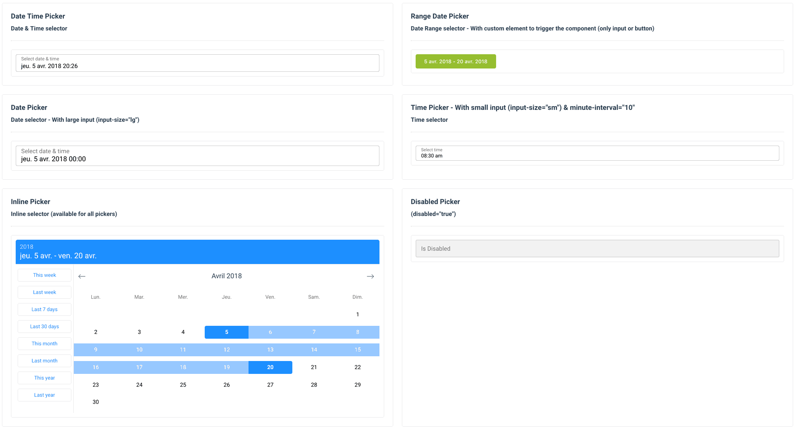

# vue-ctk-date-time-picker

> A vue component for select dates (range mode available) & time


#### Dark mode

## Demo
[Enjoy here](https://htmlpreview.github.io/?https://github.com/chronotruck/vue-ctk-date-time-picker/blob/master/demo/index.html)

## Installation

### Using yarn

`yarn add vue-ctk-date-time-picker`

### Using npm

`npm i --save vue-ctk-date-time-picker`

## Docs

`npm run serve`

## Usage

### ES6 Modules / CommonJS

```js
import VueCtkDateTimePicker from 'vue-ctk-date-time-picker';
import 'vue-ctk-date-time-picker/dist/vue-ctk-date-time-picker.min.css';

Vue.component('vue-ctk-date-time-picker', VueCtkDateTimePicker);
```

```html
<vue-ctk-date-time-picker></vue-ctk-date-time-picker>
```

### UMD

```html
<vue-ctk-date-time-picker></vue-ctk-date-time-picker>

<script src="https://unpkg.com/vue" charset="utf-8"></script>
<script src="./dist/umd/vue-ctk-date-time-picker.min.js" charset="utf-8"></script>
<link rel="stylesheet" type="text/css" href="./dist/umd/vue-ctk-date-time-picker.min.css">

<script type="text/javascript">
  Vue.component('vue-ctk-date-time-picker', window.VueCtkDateTimePicker.default);
</script>
```
Here is an example of UMD implementation: https://codepen.io/louismazel/pen/jQWNzQ

## Props API

| Props      | Type       | Required | Default    |
|------------|------------|----------|------------|
| v-model    | String/Int | yes     | -          |
| label      | String     | no    | Select date & time |
| hint (1)       | text       | no       | -         |
| error-hint (2) | Boolean    | no      | false     |
| color (3)     | String (hex) | no    | dodgerblue |
| minute-interval | Int | no    | 1    |
| formatted   | string | no    | 'llll' (momentjs format) |
| format   | string | no      | - |
| time-format   | string | no  | 'H:mm a' |
| locale (4)  | string | no     | Browser Locale |
| time-zone (5)  | string | no  | Browser Time Zone |
| disable-time   | Boolean | no     | false |
| disable-date   | Boolean | no  | false |
| without-header   | Boolean | no   | false |
| id  | string | no  | CtkDateTimePicker |
| overlay | Boolean | no | true |
| enable-button-validate | Boolean | no | false |
| min-date (6)  | string | no  | - |
| max-date (6)  | string | no  | - |
| no-weekends-days | Boolean | no | false |
| auto-close | Boolean | no | false |
| without-input | Boolean | no | false |
| overlay-background | Boolean | no | false |
| disabled-dates (7) | Boolean | no | [] |
| range-mode | Boolean | no | false |
| dark | Boolean | no | false |
| shortcuts-translation (8) | Object | no | - |

(1) hint : Is a text that replaces the label/placeholder

(2) error-hint : When is `true` --> Input border & label are red

(3) color: Replace color for the hint, the borders & time selected in dropdown

(4) locale : Default value is the locale of the browser - Ex : Set `locale="fr"` to force to French language

(5) time-zone : Default value is the time-zone of the browser - Ex : Set `Europe/Paris` to force to French TZ. Do not forget to use a format like this `YYYY-MM-DDTHH:mm:ssZ` to get the TZ
 
(6) min-date & max-date : Must be `'YYYY-MM-DD'` format

(7) Disabled-Dates is an Array of dates in 'YYYY-MM-DD' format (ex: `['2018-04-03', '2018-04-07', '2018-04-09']`)

(8) shortcuts-translation : Must be an Object like that 
``` 
{
  "this_week": "This week",
  "last_7_days": "Last 7 days",
  "last_30_days": "Last 30 days",
  "this_month": "This month",
  "last_month": "Last month",
  "this_year": "This year",
  "last_year": "Last year"
}
```

## Contribution

``` bash
# install dependencies
npm install

# serve with hot reload at localhost:8080
npm run dev
```

## Build

Build configuration is located in the `poi.config.js` file, to build just run: `npm run build`, it will build to `cjs` and `umd` directories.

## Tests

This template uses karma with chai by default, you can change test settings in poi.config.js

`npm run test`
`npm run test:watch`
`npm run test:cov`

## License

This project is licensed under [MIT License](http://en.wikipedia.org/wiki/MIT_License)
